# oricdemo2026

A HIRES-mode demoscene production for the Oric Atmos (6502A @ 1 MHz, bare
metal, no ROM calls), built with the [Oscar64](https://github.com/drmortalwombat/oscar64)
cross-compiler. A nod to the machine's own 1985 "Welcome to Oric Atmos"
tape demo — same spirit (a splash, a logo, an animated scene, a handful
of effect showcases, a credits roll), reworked as a real multi-section
production with real music, real converted photographs, and a few
original techniques of its own.

Ships as **two independent, fully-playable distributions** built from the
same source (`src/main.c` + `src/section_*.c`):

- **LOCI** (`build/oricdemo.tap` + 7 asset files) — loads via a
  [LOCI](https://github.com/sodiumlb/loci-rom) mass-storage device. The
  `.tap` itself is only the code — music and every picture load from disk
  at runtime, so **all 8 files must sit together in one folder** on the
  LOCI's SD card/USB storage (see Installation below). Requires a real
  LOCI device or an emulator that supports one; plain tape/cassette
  playback or LOCI-less emulation will load the program but leave every
  picture/music load silently failing.
- **Floppy disk** (`build/oricdemo_floppy.dsk`) — a single, fully
  self-contained bootable Microdisc disk image with everything baked in.
  No LOCI, no DOS/SEDORIC, nothing else needed at all — just boot it.

Both play the full demo end-to-end, with real AY-3-8912 music
(Arkos Tracker) and 12 sections, cycling forever once started. **If you
just want to watch/listen without any real or emulated LOCI hardware,
the floppy image is the simpler option.**

## The demo

In running order:

1. **idi8b splash** — a per-cell dissolve-in/out brand wordmark.
   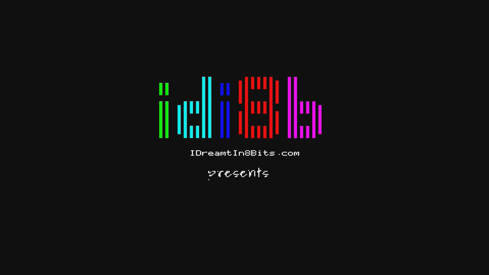
2. **Oric logo + raster bars** — the ORIC ATMOS 48K wordmark with two
   rotating, colour-cycling highlight bars sweeping behind/in front of it.
   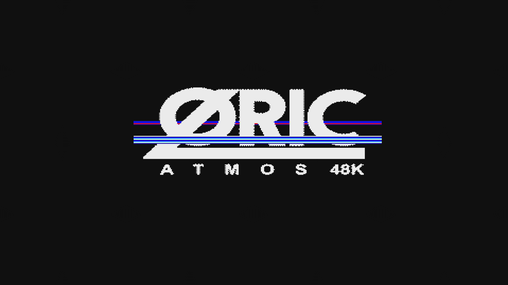
3. **Bird scene** — a parallax sky/creek backdrop with clouds and an
   animated bird flying a sine-wave path (a direct nod to the original
   1985 demo's own animated bird).
   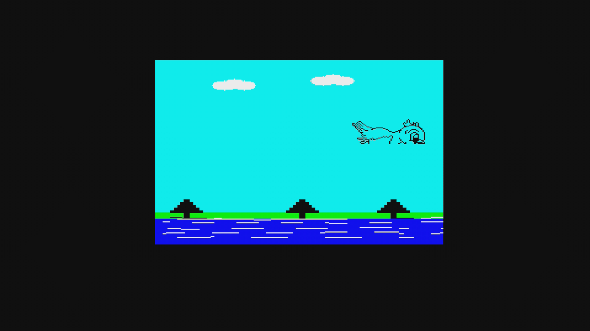
4. **HIRES shapes showcase** — ellipse, star (outline + flood-fill),
   pattern-fill, and flood-fill primitives, one at a time.
   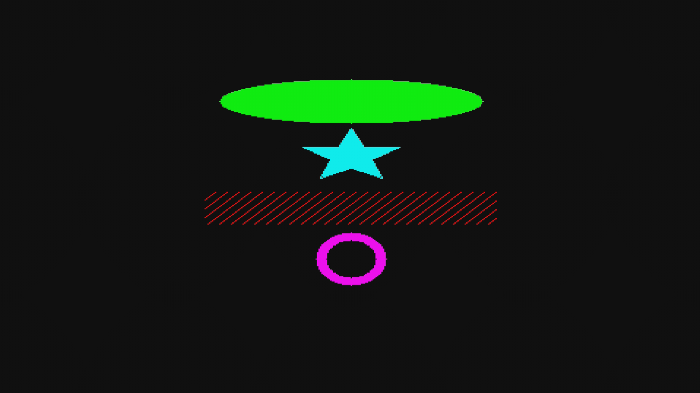
5. **Polygon workout** — a continuously rotating, pulsing wireframe star.
   
6. **3D function surface** — a rotating wireframe height-field mesh,
   projected through a real 3D camera pipeline.
   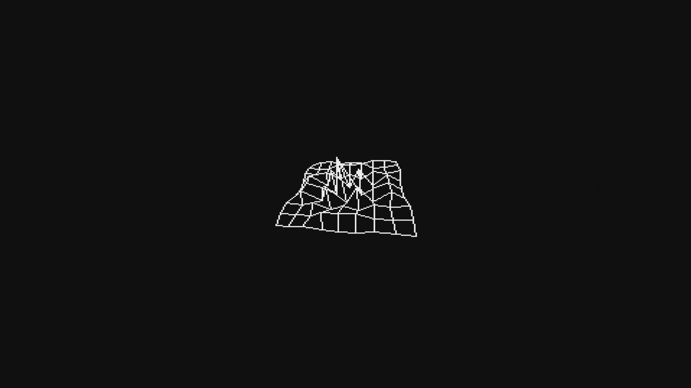
7. **Sprite showcase** — a satellite sprite drifting over a procedurally
   generated, independently-scrolling starfield.
   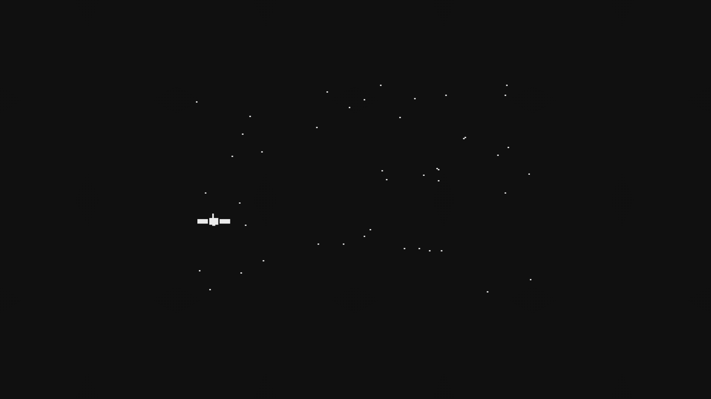
8. **Scroll showcase** — a byte-aligned hardware-charset text scroller
   over a hand-illustrated Oric Atmos desk scene.
   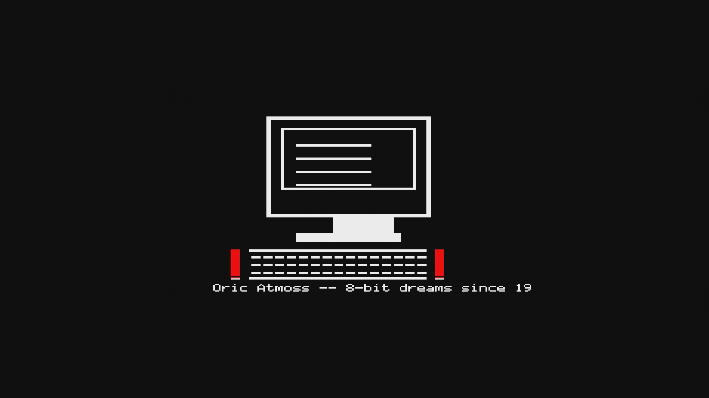
9. **Wave showcase** — a vintage magazine photo, sine-distorted in place.
   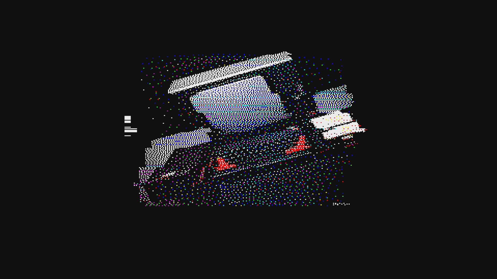
10. **Macaw showcase** — a full-colour scarlet macaw photograph with a
    scrolling caption.
    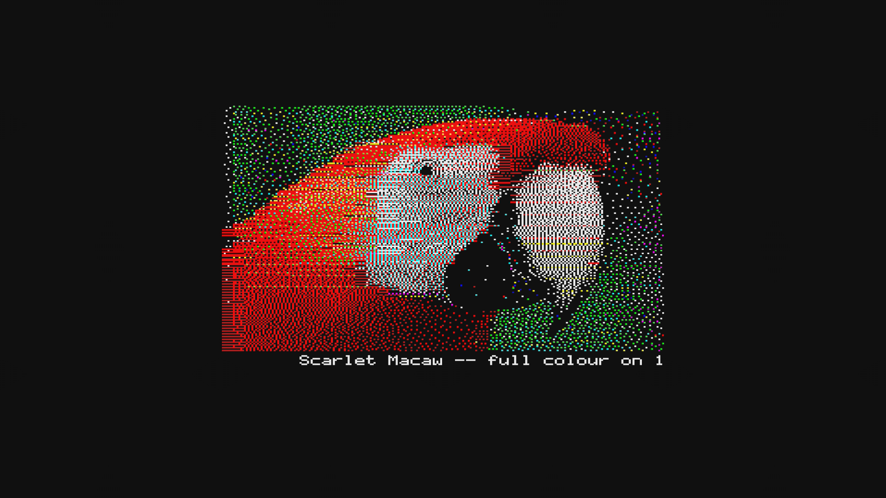
11. **Raster IRQ showcase** — three full-screen colour bars, each driven
    directly from a 50Hz hardware interrupt, sweeping over three
    procedurally-drawn stars (filled, outline, and hatched).
    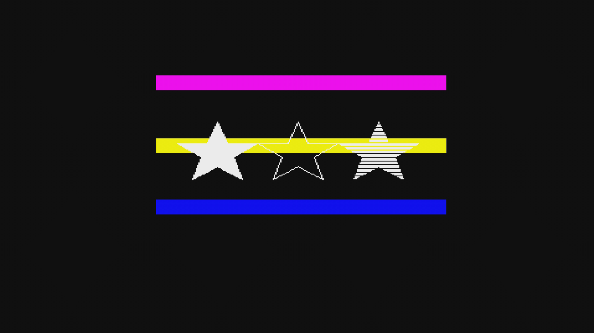
12. **Credits** — a longer-form scroll over a converted sunset photograph,
    crediting the tools, music, and source material used throughout.
    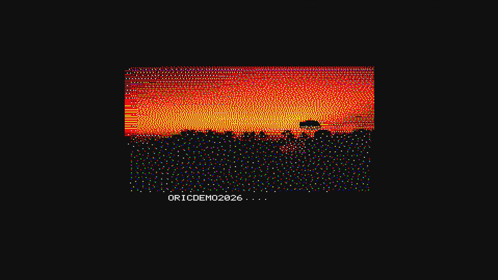

Two music tracks (Arkos Tracker `.aky` modules) alternate automatically
whenever the current one finishes a full playthrough.

See [docs/architecture.md](docs/architecture.md) for the full technical
writeup (memory maps, per-section techniques, subsystem design) and
[docs/README.md](docs/README.md) for the library reference manual behind
`include/`.

## Installation

### Floppy disk (simplest — no LOCI needed)

Boot `build/oricdemo_floppy.dsk` under Microdisc emulation (or write it to
a real floppy for real Microdisc hardware) — that's it, everything's
baked into the one image.

### LOCI

The LOCI distribution is **8 files that must all live together in one
folder** on the LOCI's SD card/USB storage — the program loads music and
every picture from that same folder at runtime (relative to wherever the
`.tap` itself was launched from, same convention as this project's sibling
[OricScreenEditorLOCI](https://github.com/xahmol/OricScreenEditorLOCI)):

| Filename | Description |
|---|---|
| `oricdemo.tap` | Main program |
| `steppingout.aky` | Music track 1 |
| `boulesetbits.aky` | Music track 2 |
| `oriclogo.bin` | Oric Atmos logo picture |
| `oricatmos.bin` | Oric Atmos desk-scene picture |
| `oricmag.bin` | Vintage magazine-photo picture |
| `macaw.bin` | Scarlet macaw photo |
| `sunset.bin` | Credits-screen sunset photo |

`make zip` builds all of these into one release ZIP, already laid out at
`idi8b/oricdemo2026/` inside the archive (the same `idi8b/<ApplicationName>/`
distribution convention this project's own `.env.example` documents for
`USBPATH`) — plus the floppy `.dsk` and a PDF of this README at the
archive's top level (unrelated to the LOCI folder requirement).

**To install:**

1. Unzip the release ZIP directly onto the LOCI device's SD card/USB
   storage root — it already contains the right `idi8b/oricdemo2026/`
   folder with all 8 files above together in it, no manual reorganizing
   needed.
2. Go to the LOCI user interface (press the LOCI's own button), select
   tape images (**T**), browse (**SPACE**) to that folder, and select
   `oricdemo.tap` with **SPACE**.
3. Boot into the program with **ESC**. If Auto Load is enabled on the
   LOCI, it starts automatically; otherwise type `CLOAD""` and press
   **RETURN**.

For details on operating the LOCI device itself, see the
[LOCI User Manual](https://github.com/sodiumlb/loci-hardware/wiki/LOCI-User-Manual).

**A LOCI device (real or emulated) is required** — plain tape/cassette
playback, or an emulator with no LOCI support, will load and run the
program, but every music/picture load will silently fail (graceful
degradation, not a crash): you'll get a mostly-blank, silent demo. See
"Building from source" below for which emulators actually emulate LOCI.

## Building from source

Requires [Oscar64](https://github.com/drmortalwombat/oscar64) and, for
testing/emulation, [Oricutron](https://github.com/pete-gordon/oricutron)
and/or [Phosphoric](https://github.com/benedictemarty/Phosphoric). Python
tooling (`tools/oric_pictconv.py`, `tools/oric_ttfconv.py`,
`tools/oric_floppybuilder.py`) needs Pillow: `pip install -r
tools/requirements.txt`.

```
make            # -> build/oricdemo.tap (LOCI target)
make disk       # -> build/oricdemo_floppy.dsk (floppy target)
make run-disk   # launch the floppy target in Oricutron -- fully self-contained,
                # including Oricutron's own debugger/monitor (F2, breakpoints)
make run-phos   # launch the LOCI target in Phosphoric, WITH LOCI emulation
                # (--loci-flash assets) -- the full experience, real AY audio too
make test       # automated regression suite (Phosphoric, headless)
make zip        # release ZIP: LOCI target + all 7 assets (under idi8b/oricdemo2026/) +
                # floppy .dsk + README.pdf (both at the ZIP's top level) -- see Installation above
make usb        # copy the LOCI target + all 7 assets + the floppy .dsk to a USB stick/LOCI SD card
```

(There's no plain Oricutron target for the LOCI/tape build — Oricutron has
no LOCI emulation, so it could only ever show a silently-degraded demo.
`run-disk` already gives the same Oricutron debugger access with a fully
working demo instead.)

`OSCAR64_HOME` defaults to `~/oscar64`, `ORICUTRON_HOME` to `~/oricutron`
if unset. `USBPATH`/`PHOSDIR` are read from `.env` (copy `.env.example` to
`.env` and fill in values). See `CLAUDE.md` for the complete build-target
reference (every `make` target, both runtimes, test fixtures) and
[docs/README.md](docs/README.md) for the `include/` library API.

## Credits

- **Code**: Xander Mol ([xahmol](https://github.com/xahmol)), built with
  [Claude Code](https://claude.com/claude-code).
- **Music**: "Stepping out" (2019) by Roald Strauss (Mr.Lou, Dewfall
  Productions), from [indiegamemusic.com](https://www.indiegamemusic.com/viewtrack.php?id=4112).
  "Boules Et Bits" by Tom & Jerry, from
  [Arkos Tracker](https://www.julien-nevo.com/arkostracker/)'s own bundled
  sample-song folder. Both Arkos Tracker modules, same sourcing/crediting
  convention as OSDK's own
  [Arkos-Music-Player](https://github.com/Oric-Software-Development-Kit/Arkos-Music-Player)
  demo, which uses the same two tracks.
- **Bird sprite**: adapted from mihai-dragan's
  [oric_BAS](https://github.com/xahmol/sprites) project (MIT License).
- **Oric Atmos logo**: Oric International's own wordmark, via
  [Wikimedia Commons](https://commons.wikimedia.org/wiki/File:Logo_Oric_Atmos.png).
- **Scarlet macaw photo**: Kandukuru Nagarjun (Jurong Bird Park), CC BY 2.0.
- **Credits-screen sunset photo**: Artem Beliaikin, via Wikimedia Commons,
  CC0.
- **A nod to** "Welcome to Oric Atmos" (Oric International, 1985) and to
  idi8b.

Every external asset's exact source/license is also credited in a header
comment at its own point of use in `src/`.
